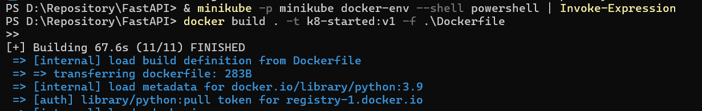
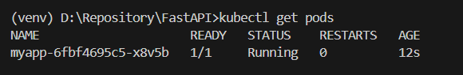

# Kubernetes Guide for local docker image
## Install tools
Install kubectl: https://kubernetes.io/vi/docs/tasks/tools/install-kubectl/

Install minikube: https://kubernetes.io/vi/docs/tasks/tools/install-minikube/

Add Kubernetes extension to Visual Studio (generate yaml file)
## Build the docker
Use commands on this site to point your terminal’s docker-cli to the Docker Engine inside minikube: https://minikube.sigs.k8s.io/docs/tutorials/docker_desktop_replacement/#Chocolatey

Then build docker

## Create a deployment.yaml file
Create a deployment.yaml file using Kubernetes extension on VSC, change image name and port accordingly to your app

Example:
```
apiVersion: apps/v1
kind: Deployment
metadata:
  name: myapp
spec:
  selector:
    matchLabels:
      app: myapp
  template:
    metadata:
      labels:
        app: myapp
    spec:
      containers:
      - name: myapp
        image: k8-started:v1
        imagePullPolicy: Never
        resources:
          limits:
            memory: "128Mi"
            cpu: "500m"
        ports:
        - containerPort: 80
```

Apply it:
```
kubectl apply -f deployment.yaml
```

Check the result:


## Expose the port and get it running

https://kubernetes.io/docs/tutorials/kubernetes-basics/expose/expose-intro/

You can either expose it using ```type: <service>``` in the yaml file or use (change "NodePort" to your desired type)

```
kubectl expose deployment/myapp --type="NodePort" --port 8080 --target-port 80
```

--target-port 80 to match the listening port in my python script

--port 8080 is associated with the ClusterIP of the service

Run the app:
```
minikube service myapp
```

Or just go to ```http://<minikube ip>:<port>``` if you are not using Docker Desktop. This is because containers inside Docker Desktop are isolated from your host computer so you need a minikube tunnel to connect to it. 

## Add Nginx as reverse proxy
